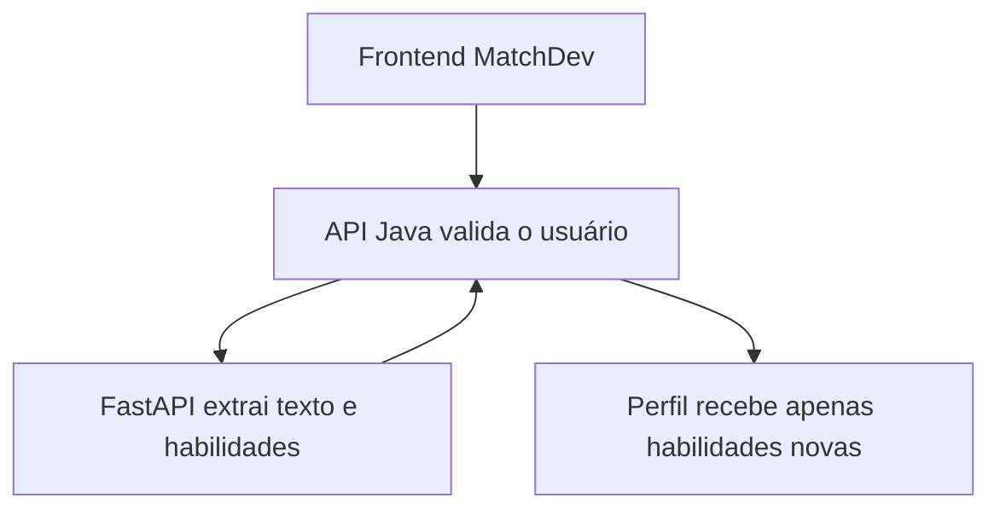
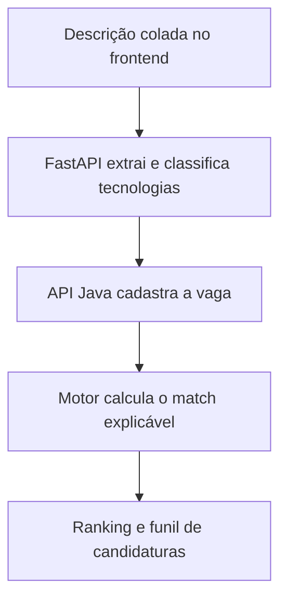

# MatchDev

API para automatizar a análise de vagas de tecnologia e explicar o quanto cada oportunidade combina com o perfil profissional do usuário.

**[Experimentar a demonstração pública](https://matchdev-app.joaoantoniosouza123.chatgpt.site)**

> A demonstração pública usa dados fictícios e foi preparada para apresentar o fluxo do produto sem expor banco de dados, currículo ou credenciais. Para persistência e integrações reais, execute a aplicação completa localmente.

O MatchDev nasceu de um problema real: encontrar vagas é fácil, mas identificar rapidamente quais merecem uma candidatura exige tempo. A aplicação organiza vagas, compara requisitos com habilidades e produz uma pontuação de compatibilidade de `0` a `100`.

## Destaques do projeto

- Arquitetura com API principal Java e microsserviço de processamento em Python;
- Algoritmo de compatibilidade determinístico, explicável e coberto por testes;
- Segurança stateless com Spring Security e JWT;
- Persistência PostgreSQL versionada com Flyway;
- Interface React responsiva com modo demonstração;
- Ambiente completo reproduzível com Docker Compose;
- Decisão consciente contra scraping: a vaga é analisada a partir do texto fornecido pelo usuário.

## Funcionalidades atuais

- Cadastro e login com autenticação JWT;
- Perfil profissional com cargo, senioridade, localização e habilidades;
- Upload de currículo em PDF;
- Extração automática de texto e habilidades técnicas;
- Sugestão de área profissional com base nas tecnologias encontradas;
- Integração entre a API Java e um microsserviço Python;
- Interface web responsiva para usar o sistema sem depender do Swagger;
- Modo demonstração para apresentar o projeto sem ligar a API;
- Cadastro e paginação de vagas;
- Importação de vaga a partir da descrição colada pelo usuário;
- Separação automática entre requisitos obrigatórios e diferenciais;
- Cálculo imediato do match após a importação;
- Prevenção de vagas duplicadas pela URL de origem;
- Análise explicável de compatibilidade;
- Identificação de habilidades atendidas e ausentes;
- Ranking de vagas da maior para a menor compatibilidade;
- Funil de candidaturas com etapas de interesse, candidatura, entrevista e proposta;
- Reanálise automática em intervalo configurável;
- Documentação interativa com Swagger;
- Migrações de banco com Flyway;
- Ambiente local com H2 e produção com PostgreSQL;
- Testes automatizados e execução com Docker.

## Tecnologias

- Java 17;
- Spring Boot 4.1;
- Spring Security e OAuth2 Resource Server;
- Spring Data JPA;
- PostgreSQL e H2;
- Flyway;
- Springdoc OpenAPI;
- Maven Wrapper;
- Python 3.12;
- FastAPI e Pydantic;
- PyPDF;
- React 19, TypeScript e Vinext;
- Docker e Docker Compose.

## Arquitetura do upload de currículo



O arquivo é processado em memória. O PDF e seu texto completo não são armazenados pela aplicação.

## Arquitetura da análise de vaga



O link original é apenas armazenado como referência. O MatchDev não acessa nem coleta páginas de terceiros, evitando dependência de scraping e respeitando as regras das plataformas de vagas.

## Como a pontuação funciona

| Critério | Peso máximo |
| --- | ---: |
| Habilidades obrigatórias | 60 pontos |
| Habilidades desejáveis | 15 pontos |
| Compatibilidade com o cargo | 10 pontos |
| Senioridade | 10 pontos |
| Modelo de trabalho | 5 pontos |

O resultado também recebe uma recomendação:

- `EXCELLENT`: 80 a 100;
- `GOOD`: 65 a 79;
- `POSSIBLE`: 45 a 64;
- `LOW`: abaixo de 45.

## Executando localmente

Pré-requisitos: Java 17 ou superior, Python 3.12 e Node.js 22.13 ou superior. Não é necessário instalar o Maven.

Primeiro, inicie o analisador de currículos. No Windows PowerShell:

```powershell
cd resume-parser
python -m venv .venv
.\.venv\Scripts\Activate.ps1
pip install -r requirements.txt
uvicorn app.main:app --reload
```

Em outro terminal, na pasta principal do projeto:

No Windows PowerShell:

```powershell
.\mvnw.cmd spring-boot:run
```

No Linux ou macOS:

```bash
./mvnw spring-boot:run
```

A aplicação utilizará um banco H2 em memória e criará três vagas de demonstração.

Em um terceiro terminal, inicie a interface web:

```powershell
cd frontend
npm install
npm run dev
```

- Interface web: <http://localhost:5173>
- Use **Explorar demonstração** para conhecer o painel sem criar uma conta;
- Para trabalhar com dados reais, mantenha a API Java e o analisador Python ligados.

- Swagger UI: <http://localhost:8080/swagger-ui.html>
- Documentação do analisador: <http://localhost:8000/docs>
- Health check: <http://localhost:8080/actuator/health>

## Fluxo rápido pelo Swagger

### 1. Criar uma conta

Use `POST /api/v1/auth/register`:

```json
{
  "fullName": "João Antonio",
  "email": "joao@example.com",
  "password": "minha-senha-segura"
}
```

Copie o valor de `accessToken`, clique em **Authorize** e informe apenas o token.

### 2. Importar o currículo

Use `POST /api/v1/profile/resume`, clique em **Try it out**, selecione seu currículo no campo `file` e execute. As habilidades encontradas serão adicionadas ao perfil.

### 3. Completar o perfil

Consulte `GET /api/v1/profile` e use `PUT /api/v1/profile` para completar os campos restantes. Preserve no JSON as habilidades importadas:

```json
{
  "headline": "Desenvolvedor Backend Java e Python",
  "desiredRole": "Desenvolvedor Backend",
  "location": "Umuarama - PR",
  "desiredSeniority": "JUNIOR",
  "skills": [
    "java",
    "spring boot",
    "python",
    "fastapi",
    "postgresql",
    "docker",
    "git"
  ],
  "preferredWorkModels": ["REMOTE", "HYBRID"]
}
```

### 4. Analisar as vagas

Na interface, abra **Analisar vaga**, informe título, empresa e cole a descrição completa. A ação chama `POST /api/v1/jobs/import`, extrai as tecnologias, cadastra a vaga e devolve o match na mesma resposta.

Depois, escolha **Acompanhar candidatura** para adicionar a oportunidade ao funil. O ranking completo permanece disponível em **Ranking de vagas**.

## Principais endpoints

| Método | Endpoint | Função |
| --- | --- | --- |
| `POST` | `/api/v1/auth/register` | Criar conta |
| `POST` | `/api/v1/auth/login` | Fazer login |
| `GET` | `/api/v1/profile` | Consultar o próprio perfil |
| `PUT` | `/api/v1/profile` | Atualizar o próprio perfil |
| `POST` | `/api/v1/profile/resume` | Importar habilidades de um PDF |
| `POST` | `/api/v1/jobs` | Cadastrar vaga |
| `POST` | `/api/v1/jobs/import` | Extrair requisitos, cadastrar e calcular o match |
| `GET` | `/api/v1/jobs` | Listar vagas ativas |
| `GET` | `/api/v1/jobs/{id}` | Consultar uma vaga |
| `POST` | `/api/v1/matches/jobs/{jobId}` | Analisar uma vaga |
| `POST` | `/api/v1/matches/refresh` | Reanalisar todas as vagas |
| `GET` | `/api/v1/matches` | Consultar ranking |
| `GET` | `/api/v1/applications` | Listar candidaturas acompanhadas |
| `POST` | `/api/v1/applications` | Adicionar uma vaga ao funil |
| `PUT` | `/api/v1/applications/{id}` | Atualizar a etapa da candidatura |

## Testes

Windows:

```powershell
.\mvnw.cmd test
```

Linux ou macOS:

```bash
./mvnw test
```

Testes do microsserviço Python:

```powershell
cd resume-parser
pip install -r requirements-dev.txt
pytest
```

## Docker com PostgreSQL

```bash
docker compose up -d --build
```

O Compose inicia a interface em `localhost:5173`, a API Java em `localhost:8080`, o analisador FastAPI em `localhost:8000` e o PostgreSQL em `localhost:5432`.

Para acompanhar o estado dos serviços:

```bash
docker compose ps -a
```

As credenciais presentes no Compose são exclusivamente para desenvolvimento local. Em qualquer implantação real, use variáveis de ambiente e segredos próprios.

## Estrutura principal

```text
src/main/java/br/com/joao/matchdev
├── auth        # Cadastro, login e emissão de JWT
├── candidate   # Perfil e preferências profissionais
├── job         # Vagas e requisitos
├── match       # Algoritmo, ranking e automação
├── tracking    # Funil e histórico de candidaturas
├── integration # Comunicação com o microsserviço Python
├── config      # Segurança, Swagger e dados de demonstração
└── common      # Tratamento padronizado de erros

resume-parser
├── app          # API FastAPI e serviços de extração
└── tests        # Testes do analisador de currículo

frontend
├── app          # Interface React e integração com a API
└── public       # Recursos públicos do site
```

## Próximas etapas

- OCR para currículos digitalizados como imagem;
- Ampliação do catálogo de habilidades;
- Importação por RSS, APIs e páginas de carreira permitidas;
- Notificações por e-mail ou Telegram;
- Métricas sobre tecnologias mais solicitadas.

## Autor

Desenvolvido por **João Antonio dos Santos Souza** como projeto de portfólio para desenvolvimento backend e automação.

## Licença

Este projeto está sob a licença MIT.
